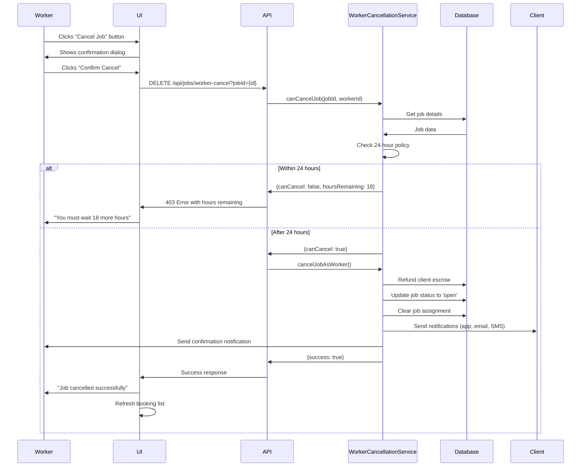

# Worker Cancellation Feature - Implementation Guide

## Overview
Workers can cancel bookings after being selected by clients, with automatic refunds and job reopening. The feature includes a **24-hour policy** to prevent abuse.

## Feature Highlights ✨

### 1. **24-Hour Protection Policy**
- Workers **CANNOT** cancel within 24 hours of being selected
- After 24 hours, workers **CAN** cancel freely
- Prevents last-minute cancellations that hurt clients

### 2. **Automatic Refund**
- Client's escrowed payment is automatically refunded to their wallet
- No manual intervention needed
- Transaction is atomic and safe

### 3. **Job Reopening**
- Job status changes from `'assigned'` → `'open'`
- Job becomes available for other workers to apply
- Previous assignment is cleared

### 4. **Comprehensive Notifications**
- **Client receives:**
  - In-app notification
  - Email notification
  - SMS notification (if phone number available)
- **Worker receives:**
  - Confirmation notification

---

## Implementation Details

### Backend Service
**File:** `/lib/worker-cancellation.service.ts`

**Key Methods:**

#### 1. `canCancelJob(jobId, workerId, dbClient)`
Checks if worker can cancel based on 24-hour policy.

**Returns:**
```typescript
{
  canCancel: boolean;
  reason?: string;
  hoursElapsed?: number;
  hoursRemaining?: number;
}
```

**Business Logic:**
```typescript
// Must be assigned to the job
if (job.assignedWorkerId !== workerId) return false;

// Job must be in 'assigned' status
if (job.status !== 'assigned') return false;

// Calculate hours since assignment
const hoursElapsed = (Date.now() - new Date(job.assignedAt).getTime()) / (1000 * 60 * 60);

// 24-hour policy
if (hoursElapsed < 24) {
  return {
    canCancel: false,
    reason: `You must wait ${Math.ceil(24 - hoursElapsed)} more hours`,
    hoursRemaining: Math.ceil(24 - hoursElapsed)
  };
}

return { canCancel: true };
```

#### 2. `cancelJobAsWorker(params)`
Executes the cancellation with full transaction handling.

**Process Flow:**
1. ✅ Validate 24-hour policy
2. 💰 Refund client's escrow → available balance
3. 🔓 Reopen job (status='open', clear assignment)
4. 📧 Notify client (in-app, email, SMS)
5. ✉️ Confirm to worker (in-app)

---

### API Endpoint
**File:** `/app/api/jobs/worker-cancel/route.ts`

**Method:** `DELETE`

**Endpoint:** `/api/jobs/worker-cancel?jobId={jobId}`

**Request Body:**
```json
{
  "workerId": "string",       // ID in WORKERS collection
  "workerUserId": "string",   // ID in USERS collection (for notifications)
  "reason": "string"          // Optional cancellation reason
}
```

**Response - Success (200):**
```json
{
  "success": true,
  "message": "Job cancelled successfully. Client has been refunded and the job is now open for applications."
}
```

**Response - 24-Hour Policy Violation (403):**
```json
{
  "success": false,
  "message": "You must wait 18 more hours before cancelling",
  "hoursElapsed": 6,
  "hoursRemaining": 18,
  "canCancelAt": "2026-01-21T08:00:00.000Z"
}
```

**Response - Not Authorized (403):**
```json
{
  "success": false,
  "message": "You are not assigned to this job"
}
```

---

### Frontend UI
**File:** `/components/worker/booking-detail-modal.tsx`

**Features:**

#### 1. Cancel Button Visibility
Shows "Cancel Job" button when:
- Booking status is `'confirmed'` (direct booking)
- Booking status is `'accepted'` (job application accepted)
- Booking status is `'in_progress'` (work started)

```typescript
const canCancel =
  currentBooking?.status === 'confirmed' ||
  currentBooking?.status === 'accepted' ||
  currentBooking?.status === 'in_progress';
```

#### 2. Confirmation Dialog
- **Warning message** about 24-hour policy
- **Refund information** for transparency
- **Keep Job** button (cancel cancellation)
- **Confirm Cancel** button (proceed)

#### 3. Error Handling
- Displays hours remaining if within 24-hour window
- Shows clear error messages
- Refreshes booking list after successful cancellation

---

## User Flow 🎯

### Scenario: Worker Cancels After Being Selected



---

## Testing Guide 🧪

### Test Case 1: Cancel Within 24 Hours (Should Fail)

**Setup:**
1. Create job as client
2. Select worker (job status = 'assigned')
3. Immediately attempt to cancel as worker

**Expected Result:**
```
❌ Error: "You must wait 24 more hours before cancelling"
Status: 403
hoursRemaining: 24
```

### Test Case 2: Cancel After 24 Hours (Should Succeed)

**Setup:**
1. Create job with `assignedAt` = 25 hours ago (modify in DB)
2. Attempt to cancel as worker

**Expected Result:**
```
✅ Success: "Job cancelled successfully. Client has been refunded and the job is now open for applications."
Status: 200

Verifications:
- Job status = 'open'
- Job assignedWorkerId = null
- Job assignedAt = null
- Job bookingId = null
- Client wallet balance increased
- Booking status = 'cancelled'
- Client received notification
- Worker received notification
```

### Test Case 3: Cancel Non-Assigned Job (Should Fail)

**Setup:**
1. Worker attempts to cancel job they're not assigned to

**Expected Result:**
```
❌ Error: "You are not assigned to this job"
Status: 403
```

---

## Database Changes

### Jobs Collection Updates:
```typescript
{
  status: 'open',                              // Was: 'assigned'
  assignedWorkerId: null,                      // Was: {workerId}
  assignedAt: null,                            // Was: {timestamp}
  bookingId: null,                             // Was: {bookingId}
  workerCancelledAt: '2026-01-20T14:30:00Z',  // NEW: Cancellation timestamp
  workerCancellationReason: 'Worker cancelled', // NEW: Reason
  updatedAt: '2026-01-20T14:30:00Z'           // Updated
}
```

### Bookings Collection Updates:
```typescript
{
  status: 'cancelled',                         // Was: 'confirmed'/'accepted'/'in_progress'
  paymentStatus: 'refunded',                   // Was: 'held'
  cancelledAt: '2026-01-20T14:30:00Z',        // NEW: Cancellation timestamp
  cancellationReason: 'Worker cancelled after 25 hours', // NEW: Reason
  updatedAt: '2026-01-20T14:30:00Z'           // Updated
}
```

### Virtual Wallets Collection Updates:
```typescript
// Client's wallet
{
  balance: 15000,          // +10000 (job amount)
  escrow: 0,               // -10000 (released from escrow)
  updatedAt: '2026-01-20T14:30:00Z'
}
```

---

## Security & Authorization

### 1. Authorization Checks
- Worker must be assigned to the job
- Worker must own the booking
- User authentication required

### 2. 24-Hour Policy Enforcement
- Enforced at service level
- Enforced at API level (double-check)
- Cannot be bypassed by client

### 3. Transaction Safety
- Atomic database operations
- Escrow refund uses existing `BookingCompletionService.cancelBooking()`
- Rollback on failure

---

## Notifications Sent

### To Client:

#### In-App Notification:
```
Title: "Worker Cancelled Job"
Message: "John Doe has cancelled "House Cleaning". Your payment has been refunded to your wallet. The job is now open for other workers to apply."
Action: View job (/client/jobs/{jobId})
```

#### Email:
- Subject: Worker Cancelled Your Job - {jobTitle}
- Body: Cancellation details, refund info, next steps

#### SMS (if phone available):
```
ErrandWork: John Doe cancelled your job "House Cleaning".
₦10,000 has been refunded to your wallet.
The job is now open for applications.
```

### To Worker:

#### In-App Notification:
```
Title: "Job Cancelled"
Message: "You cancelled "House Cleaning". The client has been refunded and the job is now available for others."
Action: View available jobs (/worker/jobs)
```

---

## Error Handling

### Common Errors:

| Error | Status | Solution |
|-------|--------|----------|
| "You must wait X more hours before cancelling" | 403 | Wait until 24 hours have elapsed |
| "You are not assigned to this job" | 403 | Verify worker assignment |
| "This job is already {status}" | 400 | Job no longer in 'assigned' status |
| "No booking found for this job" | 500 | Data integrity issue - contact support |
| "Refund failed: {reason}" | 500 | Payment issue - contact support |

---

## Feature Status: ✅ **FULLY IMPLEMENTED**

All components are in place:
- ✅ Backend service with 24-hour policy
- ✅ API endpoint with proper error handling
- ✅ Frontend UI with cancel button and confirmation
- ✅ Automatic refunds
- ✅ Job reopening
- ✅ Comprehensive notifications
- ✅ Security and authorization

---

## Usage Example

### As a Worker:

1. **Navigate to** Worker Dashboard → Bookings
2. **Click on** any booking in 'Confirmed', 'Accepted', or 'In Progress' status
3. **Click** "Cancel Job" button (top right)
4. **Read** confirmation dialog warning
5. **Click** "Confirm Cancel"

**If within 24 hours:**
- ❌ Error toast: "Cannot cancel: You must wait 18 more hours (6h elapsed since assignment)"

**If after 24 hours:**
- ✅ Success toast: "Job cancelled successfully. Client has been refunded and the job is now open for applications."
- Booking removed from list
- Client notified

---

## Future Enhancements (Optional)

### 1. Cancellation Penalties
- Track number of worker cancellations
- Apply penalties for frequent cancellers (lower visibility, temporary suspension)

### 2. Cancellation Analytics
- Dashboard showing cancellation rates
- Reasons for cancellations
- Time-to-cancel metrics

### 3. Flexible Policy
- Allow clients to set custom cancellation windows
- Emergency cancellations with admin approval

---

**Last Updated:** January 20, 2026
**Version:** 1.0.0
**Status:** Production Ready ✅
